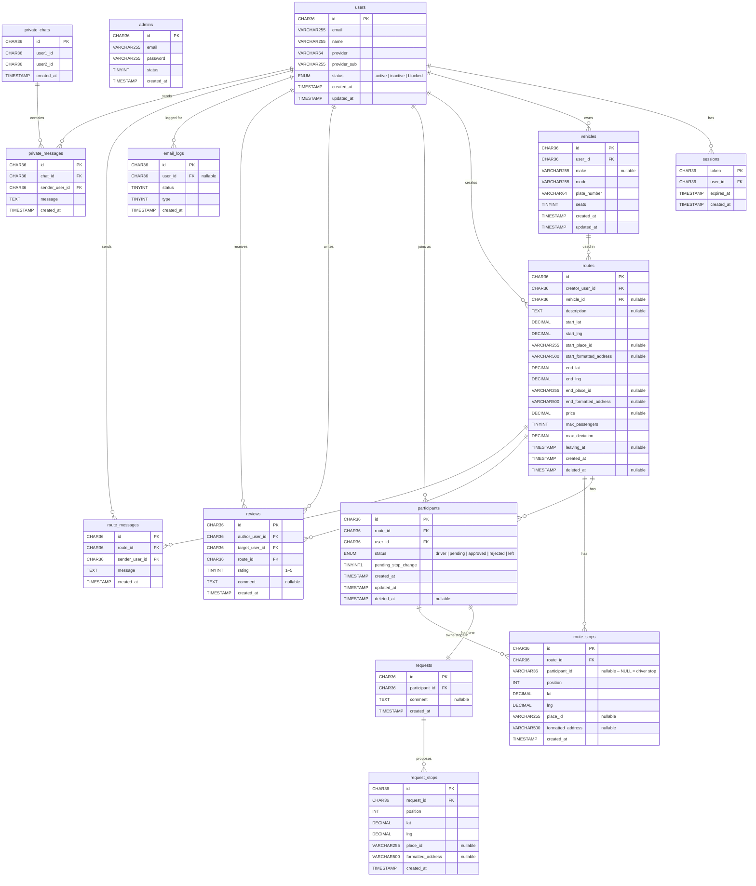

# Database Diagram

## Table overview

| Table | Role | Status |
|---|---|---|
| `users` | System accounts | Active |
| `admins` | Admin accounts (separate auth) | Active |
| `sessions` | Auth session tokens | Active |
| `email_logs` | Email send history | Active |
| `vehicles` | User-owned vehicles attached to routes | Active |
| `routes` | A driver's offered journey | Active |
| `route_stops` | Waypoints on a route; `participant_id IS NULL` = driver-owned, non-NULL = passenger-owned | Active |
| `participants` | Every person on a route (driver + passengers); `status` tracks lifecycle | Active |
| `requests` | One request record per participant; holds the current `comment` | Active |
| `request_stops` | Proposed stops submitted with an application or a stop-change request | Active |
| `reviews` | Post-trip ratings between users | Active |
| `route_messages` | Per-route group chat (schema only) | Unused |
| `private_chats` | 1-to-1 chat rooms (schema only) | Unused |
| `private_messages` | Messages in a private chat (schema only) | Unused |
